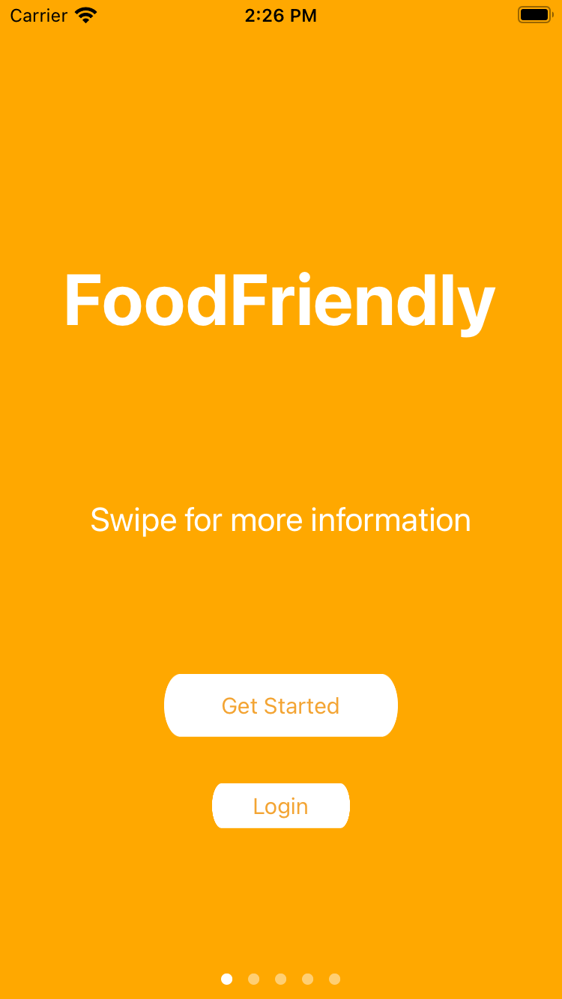
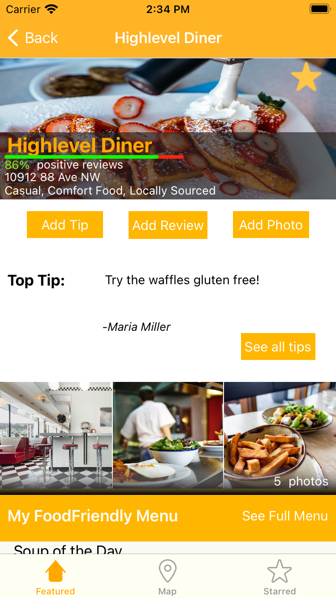
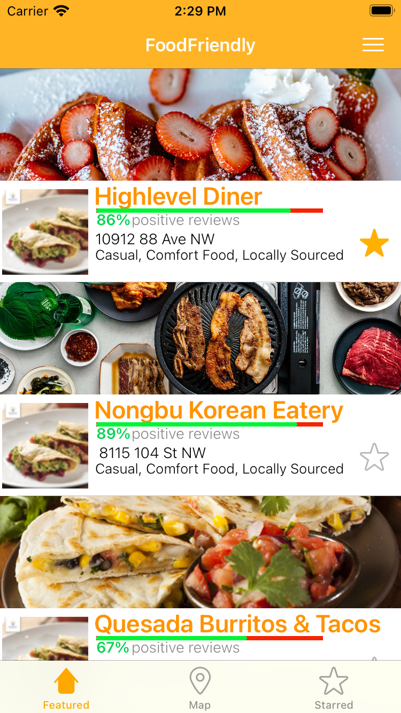
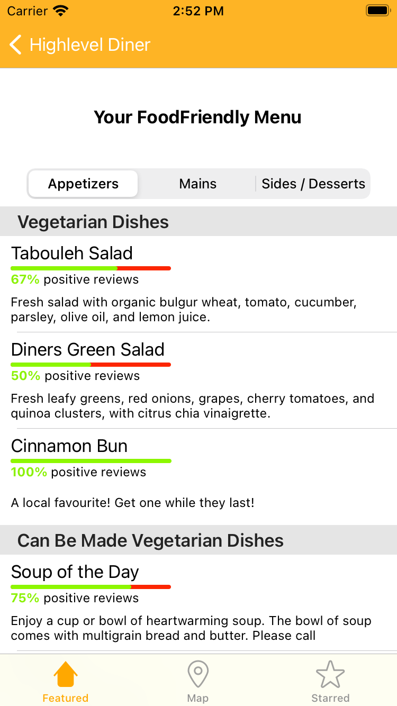

# FoodFriendly
FoodFriendly is a Proof of Concept/MVP iOS social media app that helps vegetarians and vegans find food in restaurants easier. The app was primarily developed in 2018 and was a great way to teach myself Swift and iOS development. I hope to continue working on the application to update it to be more compatible with today's iOS versions and further develop my knowledge about Swift best practices.

**View the demo here: https://youtu.be/CpdDrbAIb2Y**

  
  
  
  

As of 2018, 9.4 of Canadian adults consider themselves vegetarian, up from 4% of adults in 2003. It's expected that this number will continue to rise, as will the number of people looking to cut down the amount of meat they consume. Despite this, there are very few ways for vegetarians and vegans to evaluate whether a restaurant is suitable for them, short of reading the menu of a restaurant themselves. 

FoodFriendly aims to improve this by giving an easy way for people to view vegetarian and vegan friendly menu items and allowing vegetarian and vegan users to review restaurant menus and help out other FoodFriendly users.

## Features
New users can create an account and with FoodFriendly and specify their dietary needs. After that, restaurants are presented to users by either the Featured page, the Map page (which has search and filter functionality) and the Starred page (which shows restaurants favourited by the user). Users can see restaurants' reviews, address, distance, and photos at a glance from these pages.

Users can review restaurants and rate their food quality, dish variety, and service. Users can also rate individual dishes. Users can add tips for ordering at restaurants for other users (ex: "you can replace the cheese on any of the pizzas here with vegan cheese instead"). Users can upload images for a restaurant.

Users can view the menus for a restaurants, including reviews and descriptions for each dish. Users will only be shown the menu items that are compatible with their diet (ex: vegetarian users will be shown dishes that are vegetarian, vegan, or dishes containing meat that can be modified to be vegetarian). 

## Development
The application was developed using Swift with Firebase for authentication, storage, and database functionality. 

The MVP was primarily coded by myself in 2018, with my partner handling the business, content, and UI/UX aspects of the project. Prior to this project, I didn't have an experience with Swift or iOS development and I found this to be a great way to cut my teeth. The 

My next (coding) steps for this application would be primarily to further improve the responsiveness of the application on a wide variety of devices, increase unit test coverage for the project, and refactor how the models of the application have been set up to better deal with a NoSQL-style database. 

After that, there are a number of features I'd like to add, including 
* creating a user-friendly way for restaurants to manage their pages and menus
* creating an algorithm to dictate what restaurants appear on the featured page (ex: a combination of sponsored restaurants and restaurants that the app thinks the user would enjoy)
* open up the application for other dietary needs, such as gluten-free, pescatarian, etc.
* overall improved UI/UX across the board

